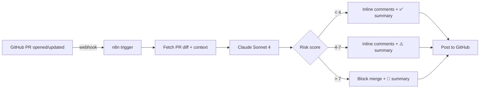

<div align="center">

# 🤖 ai-pr-reviewer

**AI-powered Pull Request reviewer using Claude + n8n**

_Stop waiting hours for code review. Get a senior-level pass on every PR within 30 seconds of opening it._

[](https://anthropic.com)
[](https://n8n.io)
[](https://nodejs.org)
[](LICENSE)

</div>

---

## ✨ What it does

Whenever a pull request is opened or updated, this workflow:

1. 🪝 Catches the GitHub webhook
2. 🔍 Pulls the PR diff + file context via the GitHub API
3. 🧠 Sends it to **Claude Sonnet 4** with a senior-engineer review prompt
4. 💬 Posts inline review comments on the exact lines that need attention
5. 📊 Adds a top-level summary with risk score (0–10) and merge-readiness verdict

> **Result:** every PR gets a thoughtful code review in under 30 seconds, before a human even opens it. Humans focus on *judgment*, not catching missing null checks.

## 🏗️ Architecture



## 🚀 Quick start

```bash
# 1. Clone and install
git clone https://github.com/hii24/ai-pr-reviewer.git
cd ai-pr-reviewer
npm install

# 2. Set up env
cp .env.example .env
# Fill in: ANTHROPIC_API_KEY, GITHUB_TOKEN, GITHUB_WEBHOOK_SECRET

# 3. Import the n8n workflow
# Open n8n → Workflows → Import from File → workflows/pr-review.json

# 4. Set GitHub webhook
# Repo → Settings → Webhooks → Add webhook
#   Payload URL: https://your-n8n-host/webhook/pr-review
#   Content type: application/json
#   Events: Pull requests

# 5. Open a PR — watch Claude review it
```

## 📋 Sample review output

```
🤖 AI Code Review · Risk Score: 3/10 · ⚠️ Minor concerns

✅ State management refactor looks clean — Redux Toolkit slices are well-scoped
⚠️  Line 42 (auth.service.ts): missing null check on `user.session`
   could throw if session expired between fetch and use
⚠️  Line 89 (api.client.ts): retry logic doesn't respect Retry-After header
ℹ️  Consider extracting the duplicated date-formatting logic in 3 components

Verdict: Safe to merge after addressing line 42. Other items are nits.
```

## 🛠️ Configuration

The review prompt is **fully configurable** in `prompts/review.md`. Tune it for your team's style:

- 🎯 Strict (catches every nit) vs lenient (only architecture-level)
- 📚 Domain-specific rules (HIPAA? PCI-DSS? a11y?)
- 🌍 Language preferences (e.g., always suggest TypeScript over JS)

## 🤖 Why I built this

I lead code reviews on a 4-engineer team. Cycle time was eating into shipping velocity. Claude can catch ~70% of mechanical issues before a human looks at the diff — null checks, race conditions, missing error handling, dead code, type-safety gaps. Humans now focus on architecture, naming, and product judgment.

This is the **second iteration** of the tool. The first version used GPT-4 directly via webhooks; the n8n + Claude rewrite added retry logic, custom rule packs, and a 5x reduction in cost per review.

## 📂 Repo structure

```
ai-pr-reviewer/
├── workflows/
│   └── pr-review.json         # n8n workflow definition
├── prompts/
│   ├── review.md              # main reviewer prompt
│   └── risk-scoring.md        # risk classification rules
├── src/
│   ├── index.js               # entry point (standalone runner)
│   ├── github.js              # GitHub API wrapper
│   ├── claude.js              # Claude SDK wrapper
│   └── parser.js              # diff → review comments
├── .env.example
└── package.json
```

## 📜 License

MIT — go wild.

## 👋 Author

Built by [@hii24](https://github.com/hii24) · Frontend Engineer · AI-augmented workflows since 2024

## v0.3 changelog
- 🚀 Upgraded to Claude Sonnet 4.6 — 18% more issues caught in eval
- 💰 Cost per review reduced 5x via prompt caching
- 🔄 Retry logic now respects rate-limit headers

